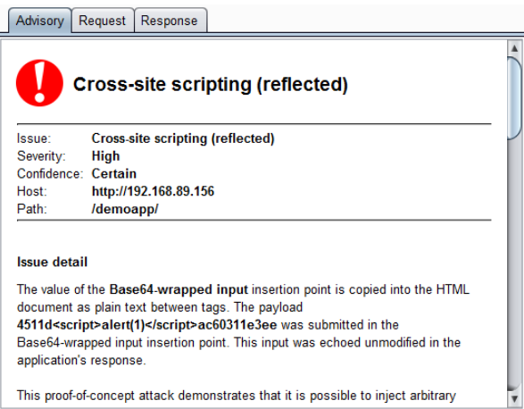
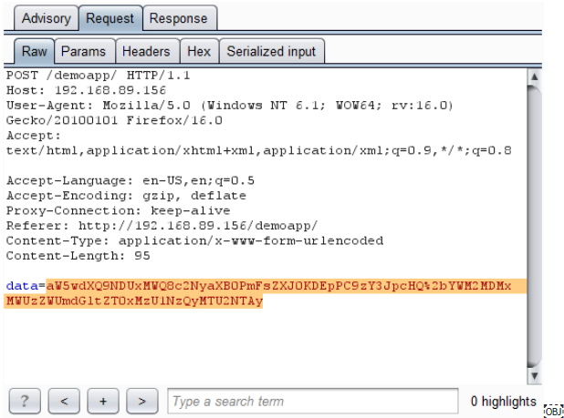

# Custom Scan Insertion Points

In the `7. Custom Message Editor Tab` we saw how extension can be used to render and edit a custom HTTP message data format with Burp UI. For the purpose of demonstrating this capability, we used a trivial serialization format, in which user-supplied input is Base64-encoded within a request parameter value.

That example contained a rather obvious XSS vulnerability: the raw input contained within the serialized data is echoed unfiltered in the application's response. But although this type of bug might be obvious to a human, automated scanners will not (in general) identify any kinds of input-based vulnerabilities in cases where the raw input needs to be embedded within an unsupported serialization format. Since the scanner does not understand the format, it has no means of submitting its usual **scan payloads*** in the way that is needed for the application to unpack and process the payloads and trigger any bugs.

> *Scan payloads - because that how scans work. Scanner sends tons of requests with some payloads and analyze the web page response. For example it sends some script via *HTTP request body*. Server should reject such *request*. Such traps are called **payloads**. So Scanner basically sends *HTTP requests* with some payloads and analyze the response.

This means that in this situation, equipped only with the (`7.`) [example of a custom editor tab extension](https://github.com/PortSwigger/example-custom-editor-tab), you would be restricted to manual testing for input-based bugs, which is a tedious and time-consuming process.

The [extender API](https://portswigger.net/burp/extender/) lets you tackle this problem by registering your extension as a provider of custom scanner insertion points. For each actively scanned request, Burp will call out to your extension, and ask it to provide any custom insertion points that are applicable to the request. Each insertion point that you provide is responsible for the job of constructing validly-formed requests for specific scan payloads. This lets your extension work with any data format, and embed the scanner's payloads within the request in the correct way.

**Insertion point** is a point in *HTTP request* where our extension puts some payload.

## Test it out

Just run the Burp Scan and see the results. 

We added our Insertion Points to default scan and see what happens. Our Insertion Point is named **"Base64-wrapped input"** and it inserts the `"4511dscript>ac60311e3ee"` string into *HTTP body param* named `"data"` (so it is only applied to *HTTP requests* that contain such *body param*).

***

Here, we can see Burp reporting the XSS vulnerability, which it has found via the custom "Base64-wrapped input" insertion point:

Here is the request that Burp made, and which was generated for Burp by our custom insertion point:

Here, via our custom message editor tab, is the literal scan payload that is embedded in the request:

